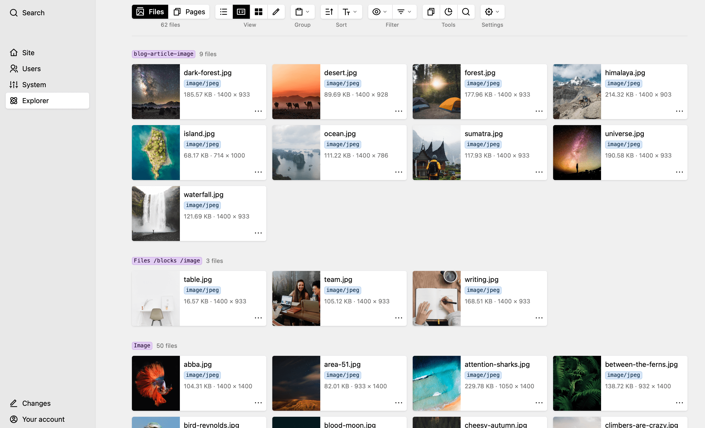
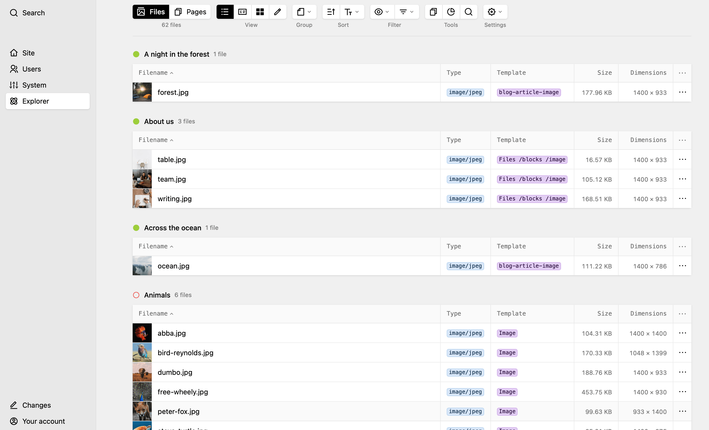
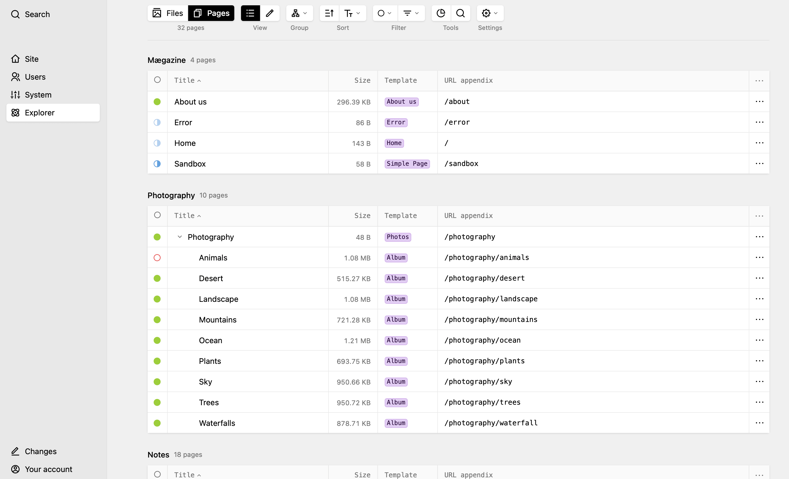
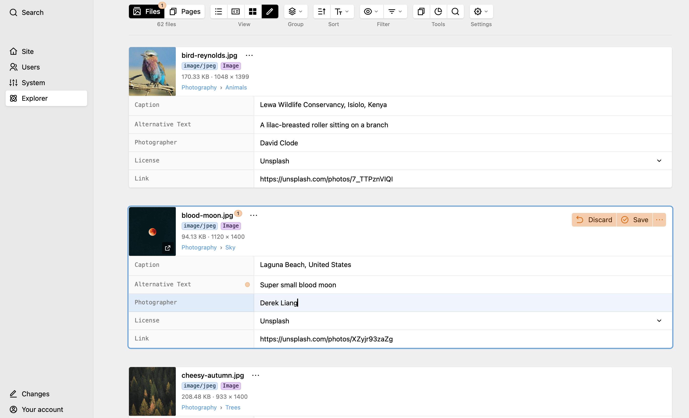
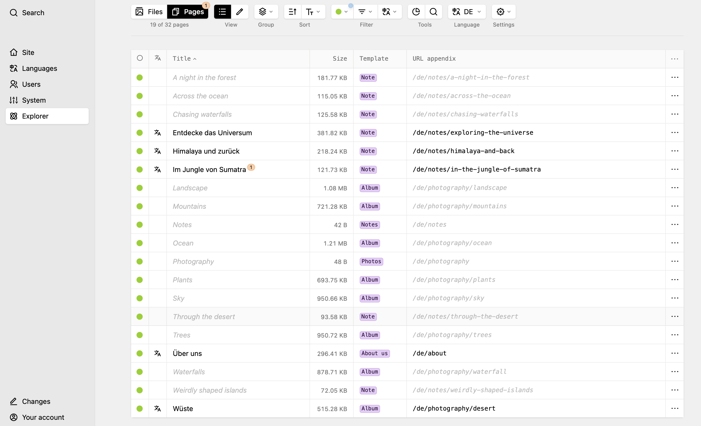

# Kirby Explorer

A Finder-like overview of **files and pages** of a Kirby project, as its own
panel area.

Requires **Kirby 5** and **PHP 8.2+**.

## Main Features

- Every file and every page of the site in one place
- Unused files at a glance – checked against the whole content
- Statistics on storage, templates, usage, and how far content and
  translations are along
- Light and dark mode
- Speaks every language the panel does – all 34 of them
- Free to use, with a one-time activation per domain


*Every file of a Kirby project, grouped by template*

## Files view

- Four views: list, cardlets, cards and edit
- Group by page, template, file type, usage or translation state
- Sort by any column
- Filter by file type and usage
- Search across name, format, template and page
- Act on a selection: download as a zip, change the template, delete
- Find duplicates and see what their copies cost


*The list view, grouped by the page a file belongs to*

## Pages view

- Two views: list and edit
- Group by site structure, status, template or translation state
- Sort by any column
- Filter by template and status
- Search across title, slug and template
- Act on a selection: change the status or the template, delete


*Pages in the order of the site tree, with size and template*

## Editing

- Edit the fields of many files or pages in one go, without opening each one


*Edit blueprint fields of every file in one place*


## Multi-language

- Find pages with missing translations
- Find files with missing translated meta fields
- Every view follows the language you pick


*Spot pages with missing translations*

## Installation

Download the plugin and put it into `site/plugins/kirby-explorer`, or:

```bash
git clone https://github.com/kirbydesk/kirby-explorer.git site/plugins/kirby-explorer
```

```bash
composer require kirbydesk/kirby-explorer
```

The plugin ships built assets (`index.js`, `index.css`); no build step is
needed to use it.

## Options

The duplicate checksums can be cached. The cache is off by default; switch it
on in `site/config/config.php`:

```php
return [
    'kirbydesk.kirby-explorer.cache.duplicates' => true,
];
```

Everything else follows the panel: the explorer appears in the menu for every
user whose role may access it, and every read and write respects Kirby's own
permissions (`update`, `delete`, `changeTemplate`, `access`).

## Activation

The plugin is free, but every domain is activated once. The panel takes care of
it: one click, and the key is stored in `site/config/.kirby-explorer`. Local
domains are never asked.

Where the server cannot reach the site – behind a password, in an intranet, on
a staging server – the dialog leads to a form at
[activate.kirbyexplorer.com](https://activate.kirbyexplorer.com). The key is
then sent by mail, with a link that activates the domain in one click.

To enter a key by hand instead, put it into your `config.php`:

```php
return [
    'kirbydesk.kirby-explorer.license' => 'YOUR-KEY-GOES-HERE',
];
```

A key belongs to one domain and works for that domain alone. Subdomains count
as their own domain; `www.` does not.

## License

Free to use, in as many projects as you like, commercial ones included – but
not open source: the plugin may not be resold, republished or bundled, and the
activation may not be removed. The full terms are in [LICENSE.md](LICENSE.md).

© [kirbydesk](https://kirbydesk.com)
